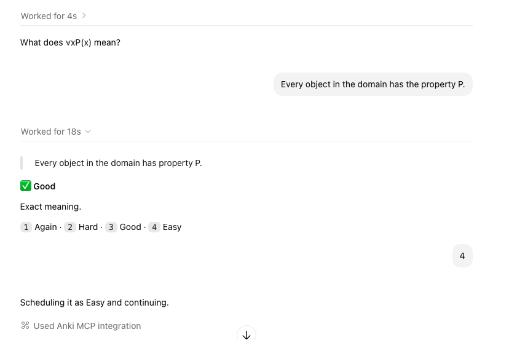
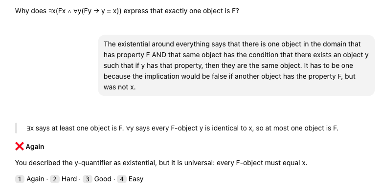

# Anki learning stack for Codex

An integrated, local-first system for building, inspecting, analyzing, grading, and reviewing Anki decks through Codex, Anki MCP, AnkiConnect, and an optional AI typed-answer grader.

## Included components

| Component | Purpose |
| --- | --- |
| `skills/` | Four Codex skills for card creation, collection inspection, deck analysis, and live chat review. |
| `anki-ai-grader/ai_grader/` | An Anki add-on that grades typed answers with the OpenAI Responses API. |
| `anki-ai-grader/local-review-stack/` | A reproducible ticketed-review stack with maintained AnkiConnect and Anki MCP source snapshots, tests, build scripts, and rollback tooling. |
| `assets/` | Positive and negative examples of the review experience. |

## Included skills

| Skill | Purpose |
| --- | --- |
| `add-anki-cards` | Design, quality-check, add, and verify cards. |
| `inspect-anki` | Inspect decks, note types, fields, cards, and notes safely. |
| `analyze-anki-deck` | Analyze a deck's cards, statistics, formulation, and scheduling. |
| `chat-anki-review` | Run an interactive review session in Codex and schedule each answer only after you choose a rating. |

## Requirements

- [Anki](https://apps.ankiweb.net/) running locally
- [AnkiConnect](https://ankiweb.net/shared/info/2055492159), using its default local endpoint (`http://127.0.0.1:8765`)
- Codex with these skills installed
- Optional: an Anki MCP server exposing the tools named in the skills
- Optional: an OpenAI API key for the in-Anki typed-answer grader

The skills never write directly to Anki's database. Anki changes go through Anki MCP or AnkiConnect, and destructive or modifying actions require explicit authorization.

## Philosophy: understanding first, retrieval always

Traditional flashcards are excellent at one important job: repeatedly retrieving a stable answer at the right time. They become less effective when a complex idea is compressed into a long answer, when wording is mistaken for understanding, or when success on one memorized example creates the illusion that a transferable skill has been learned.

These skills keep Anki's scheduling strength while broadening what a review can test. The guiding ideas are:

- **Learn before memorizing.** An unresolved explanation should be clarified before it becomes a permanent card.
- **One identifiable learning target per card.** A card can test a fact, distinction, mechanism, diagnosis, application, or transfer—not an accidental bundle of all of them.
- **Grade meaning rather than wording.** Correct paraphrases and equivalent representations should pass; missing meaning-bearing facts should not.
- **Make the prompt define the contract.** The learner should never be graded on details the question did not request.
- **Vary practice when variation is the skill.** Generated exercises can change the structure of a problem while preserving a frozen learning target, difficulty, verification method, and grading standard.
- **Keep the learner in control.** Codex may judge an answer, but only the learner's explicit Again, Hard, Good, or Easy choice changes Anki's schedule.
- **Treat misses as evidence.** Lapses can reveal a missing prerequisite, a weak distinction, an overloaded card, or genuinely difficult material; they are not automatically a failure of effort.

### What this adds beyond a conventional flashcard workflow

The system supports three complementary forms of practice:

1. **Fixed-answer cards** for stable facts, labels, rules, and narrow distinctions.
2. **Fixed open-response cards** when one stable prompt admits several independently verifiable correct answers.
3. **Generated-problem cards** when the learner should solve fresh instances instead of remembering the surface details of one example.

Together, these allow a deck to train recall and also probe explanation, comparison, error diagnosis, application, synthesis, and transfer. Chat review can accept a sound answer expressed in the learner's own words, give a concise reason for the grade, handle card media, and immediately continue through Anki's live learning and relearning queues. Deck analysis adds another feedback loop by connecting scheduling signals with the actual formulation of observed cards.

The gain is not “AI instead of flashcards.” It is a hybrid: Anki remains the source of truth for cards and scheduling, while Codex helps author better prompts, validate richer responses, generate controlled practice, and diagnose why a card is difficult.

### Expect a slower pace

This flow is intentionally slower than rapidly flipping through conventional flashcards. The learner has to produce an answer, Codex evaluates its meaning, the reference or targeted feedback is revealed, and the learner explicitly chooses the scheduling rating. Open responses and generated problems take even longer because they demand explanation, construction, or transfer rather than recognition alone.

That slower pace is a feature when the goal is deliberate practice: fewer prompts can produce richer evidence about what the learner understands, where the reasoning broke down, and whether knowledge transfers to a new case. It is still a real tradeoff. If the goal is maximum cards per minute, quick recognition, or high-volume rehearsal of stable facts, this workflow may not be the right fit. Use ordinary Anki review for those sessions, or reserve chat review for the smaller subset of cards that benefits from deeper grading.

### Traditional flashcards still have a place

Not every card should be open-ended or generative. Conventional fixed-answer and image-based cards are often the clearest and most efficient choice when the target really is stable recall or recognition. Anatomy, geography, vocabulary, symbols, dates, formulas, and visual identification are strong examples: identifying a bone on an image or recalling a country's capital usually benefits from a consistent target and an unambiguous answer.

Even in anatomy or geography, richer cards can be added selectively—for example, distinguishing commonly confused structures, explaining how location relates to function, or comparing neighboring regions. Those cards should supplement the clean recognition cards, not replace them. The right card type follows the learning target.

## Install

Copy the skill directories into your personal Codex skills directory:

```sh
cp -R skills/* ~/.codex/skills/
```

Restart Codex so it discovers the installed skills. Keep Anki open whenever you create, inspect, analyze, or review cards.

For the complete maintained review stack, build from the consolidated source:

```sh
cd anki-ai-grader/local-review-stack
./scripts/build.sh
./scripts/verify.sh
```

The build script installs Node dependencies only when needed, type-checks and builds the MCP server, and packages the maintained AnkiConnect source. The verification workflow uses disposable collections and a localhost-only sync server; it does not open a real Anki profile.

If you use a local Anki MCP server, add its command to `~/.codex/config.toml`. Replace the placeholder with the server's real path:

```toml
[mcp_servers.anki-mcp]
command = "node"
args = ["/absolute/path/to/anki-codex-skills/anki-ai-grader/local-review-stack/anki-mcp-server/dist/main-stdio.js"]

[mcp_servers.anki-mcp.env]
ANKI_CONNECT_URL = "http://localhost:8765"
```

## Create a deck and cards

Ask Codex in ordinary language. A useful initial prompt is:

> Create an Anki deck named “Discrete Mathematics”. Use Basic cards. Help me turn these notes into concise cards, show me the proposed cards first, then add and verify them after I approve.

Recommended flow:

1. Open Anki and start the request in Codex.
2. Codex inspects the available decks, note types, and field names.
3. If the deck does not exist, explicitly authorize creating it through AnkiConnect or your Anki MCP server.
4. Codex identifies the learning target, checks correctness, and proposes focused cards.
5. You approve the exact cards or explicitly authorize adding suitable cards as it goes.
6. Codex adds the notes with duplicate prevention and verifies the returned note IDs.

For conceptual material, the card-creation skill favors short, meaning-focused prompts, useful contrasts, examples, counterexamples, applications, and transfer questions. It can also create fixed open-response or generated-problem cards when the installed Anki note type supports them.

More prompt examples:

> Add cards to “Discrete Mathematics” from these notes. Preserve my wording unless a correction is required, and ask before writing to Anki.

> Inspect “World Flags”, then propose support cards for concepts that are already in the deck. Do not add anything until I approve it.

> Analyze my “Biology” deck using this deck-specific statistics export and recommend the highest-impact card edits.

## Review a deck in chat

Start with a deck name:

> Review my “Discrete Mathematics” deck.

Codex syncs Anki, resolves the deck name, and fetches one available card at a time. It shows only the question until you answer. After grading, it reveals the answer, gives a concise `Good` or `Again` judgment, and asks you to select the scheduling rating:

```text
1 Again · 2 Hard · 3 Good · 4 Easy
```

Only your explicit rating schedules the card. Codex then fetches the next card from Anki's live queue, including learning and relearning cards when they reappear. Say “done” to stop and sync.

### Positive example

The learner gives the exact semantic meaning of the formula. Codex reveals the reference answer, grades the response `Good`, gives a short reason, and waits for the learner's explicit rating. The learner chooses `4` (`Easy`), so Codex schedules it and continues.



### Negative example

The learner's answer captures the broad idea of uniqueness but misreads the inner universal quantifier as existential. Codex reveals the compact reference answer and marks the response `Again`, identifying the smallest material error instead of rewarding a plausible-sounding explanation. It still waits for the learner—not the model—to choose the scheduling rating.



These examples show the intended balance: accept correct meaning without requiring identical wording, but remain strict when a logical distinction changes the claim.

## Repository layout

```text
.
├── assets/
│   ├── chat-review-example.png
│   ├── negative-review-example.png
│   └── positive-review-example.png
├── anki-ai-grader/
│   ├── ai_grader/
│   ├── local-review-stack/
│   │   ├── anki-connect/
│   │   └── anki-mcp-server/
│   └── scripts/
├── skills/
    ├── add-anki-cards/
    ├── analyze-anki-deck/
    ├── chat-anki-review/
    └── inspect-anki/
├── SOURCE_PROVENANCE.md
└── THIRD_PARTY_NOTICES.md
```

Each skill is self-contained. Supporting references, scripts, and agent metadata live alongside its `SKILL.md`.

## Licensing and upstream projects

This repository is an aggregate containing original material and modified third-party projects under different licenses. See [THIRD_PARTY_NOTICES.md](THIRD_PARTY_NOTICES.md) and [SOURCE_PROVENANCE.md](SOURCE_PROVENANCE.md) before redistributing it.

- The included AnkiConnect snapshot is based on `FooSoft/anki-connect` and remains under GPL-3.0-or-later. Its license notice is retained in its source directory.
- The included Anki MCP snapshot is pinned to upstream commit `7d017e7` (v0.18.5), which was MIT-licensed at that revision. Its MIT license is retained in its source directory.
- Anki itself is not included. Anki is AGPL-3.0-or-later and is a separate prerequisite.
- The repository is unofficial and is not affiliated with or endorsed by Ankitects, the AnkiConnect maintainers, or the Anki MCP maintainers.

Publishing source on GitHub does not by itself grant a license to the original portions of this repository. A repository-wide license for the original skills, grader, scripts, documentation, and assets should be selected explicitly; the third-party subtrees remain governed by their own notices regardless of that choice.
