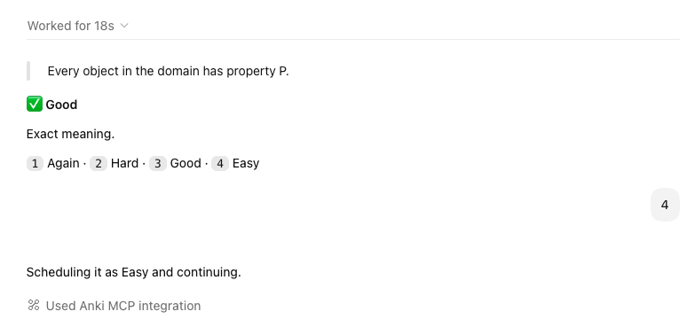

# Anki skills for Codex

Four Codex skills for building, inspecting, analyzing, and reviewing Anki decks through Anki MCP or AnkiConnect.

## Included skills

| Skill | Purpose |
| --- | --- |
| `add-anki-cards` | Design, quality-check, add, and verify cards. |
| `inspect-anki` | Inspect decks, note types, fields, cards, and notes safely. |
| `analyze-anki-deck` | Analyze a deck's cards, statistics, formulation, and scheduling. |
| `chat-anki-review` | Run an interactive review session in Codex and schedule each answer only after you choose a rating. |

## Requirements

- [Anki](https://apps.ankiweb.net/) running locally
- [AnkiConnect](https://ankiweb.net/shared/info/2055492159), using its default local endpoint (`http://127.0.0.1:8765`)
- Codex with these skills installed
- Optional: an Anki MCP server exposing the tools named in the skills

The skills never write directly to Anki's database. Anki changes go through Anki MCP or AnkiConnect, and destructive or modifying actions require explicit authorization.

## Philosophy: understanding first, retrieval always

Traditional flashcards are excellent at one important job: repeatedly retrieving a stable answer at the right time. They become less effective when a complex idea is compressed into a long answer, when wording is mistaken for understanding, or when success on one memorized example creates the illusion that a transferable skill has been learned.

These skills keep Anki's scheduling strength while broadening what a review can test. The guiding ideas are:

- **Learn before memorizing.** An unresolved explanation should be clarified before it becomes a permanent card.
- **One identifiable learning target per card.** A card can test a fact, distinction, mechanism, diagnosis, application, or transfer—not an accidental bundle of all of them.
- **Grade meaning rather than wording.** Correct paraphrases and equivalent representations should pass; missing meaning-bearing facts should not.
- **Make the prompt define the contract.** The learner should never be graded on details the question did not request.
- **Vary practice when variation is the skill.** Generated exercises can change the structure of a problem while preserving a frozen learning target, difficulty, verification method, and grading standard.
- **Keep the learner in control.** Codex may judge an answer, but only the learner's explicit Again, Hard, Good, or Easy choice changes Anki's schedule.
- **Treat misses as evidence.** Lapses can reveal a missing prerequisite, a weak distinction, an overloaded card, or genuinely difficult material; they are not automatically a failure of effort.

### What this adds beyond a conventional flashcard workflow

The system supports three complementary forms of practice:

1. **Fixed-answer cards** for stable facts, labels, rules, and narrow distinctions.
2. **Fixed open-response cards** when one stable prompt admits several independently verifiable correct answers.
3. **Generated-problem cards** when the learner should solve fresh instances instead of remembering the surface details of one example.

Together, these allow a deck to train recall and also probe explanation, comparison, error diagnosis, application, synthesis, and transfer. Chat review can accept a sound answer expressed in the learner's own words, give a concise reason for the grade, handle card media, and immediately continue through Anki's live learning and relearning queues. Deck analysis adds another feedback loop by connecting scheduling signals with the actual formulation of observed cards.

The gain is not “AI instead of flashcards.” It is a hybrid: Anki remains the source of truth for cards and scheduling, while Codex helps author better prompts, validate richer responses, generate controlled practice, and diagnose why a card is difficult.

### Traditional flashcards still have a place

Not every card should be open-ended or generative. Conventional fixed-answer and image-based cards are often the clearest and most efficient choice when the target really is stable recall or recognition. Anatomy, geography, vocabulary, symbols, dates, formulas, and visual identification are strong examples: identifying a bone on an image or recalling a country's capital usually benefits from a consistent target and an unambiguous answer.

Even in anatomy or geography, richer cards can be added selectively—for example, distinguishing commonly confused structures, explaining how location relates to function, or comparing neighboring regions. Those cards should supplement the clean recognition cards, not replace them. The right card type follows the learning target.

## Install

Copy the skill directories into your personal Codex skills directory:

```sh
cp -R skills/* ~/.codex/skills/
```

Restart Codex so it discovers the installed skills. Keep Anki open whenever you create, inspect, analyze, or review cards.

If you use a local Anki MCP server, add its command to `~/.codex/config.toml`. Replace the placeholder with the server's real path:

```toml
[mcp_servers.anki-mcp]
command = "node"
args = ["/absolute/path/to/anki-mcp-server/dist/main-stdio.js"]

[mcp_servers.anki-mcp.env]
ANKI_CONNECT_URL = "http://localhost:8765"
```

## Create a deck and cards

Ask Codex in ordinary language. A useful initial prompt is:

> Create an Anki deck named “Discrete Mathematics”. Use Basic cards. Help me turn these notes into concise cards, show me the proposed cards first, then add and verify them after I approve.

Recommended flow:

1. Open Anki and start the request in Codex.
2. Codex inspects the available decks, note types, and field names.
3. If the deck does not exist, explicitly authorize creating it through AnkiConnect or your Anki MCP server.
4. Codex identifies the learning target, checks correctness, and proposes focused cards.
5. You approve the exact cards or explicitly authorize adding suitable cards as it goes.
6. Codex adds the notes with duplicate prevention and verifies the returned note IDs.

For conceptual material, the card-creation skill favors short, meaning-focused prompts, useful contrasts, examples, counterexamples, applications, and transfer questions. It can also create fixed open-response or generated-problem cards when the installed Anki note type supports them.

More prompt examples:

> Add cards to “Discrete Mathematics” from these notes. Preserve my wording unless a correction is required, and ask before writing to Anki.

> Inspect “World Flags”, then propose support cards for concepts that are already in the deck. Do not add anything until I approve it.

> Analyze my “Biology” deck using this deck-specific statistics export and recommend the highest-impact card edits.

## Review a deck in chat

Start with a deck name:

> Review my “Discrete Mathematics” deck.

Codex syncs Anki, resolves the deck name, and fetches one available card at a time. It shows only the question until you answer. After grading, it reveals the answer, gives a concise `Good` or `Again` judgment, and asks you to select the scheduling rating:

```text
1 Again · 2 Hard · 3 Good · 4 Easy
```

Only your explicit rating schedules the card. Codex then fetches the next card from Anki's live queue, including learning and relearning cards when they reappear. Say “done” to stop and sync.

### Example

The screenshot below shows a correct answer graded `Good`, followed by the learner selecting `4` (`Easy`) and Codex continuing the live Anki schedule.



## Repository layout

```text
.
├── assets/
│   └── chat-review-example.png
└── skills/
    ├── add-anki-cards/
    ├── analyze-anki-deck/
    ├── chat-anki-review/
    └── inspect-anki/
```

Each skill is self-contained. Supporting references, scripts, and agent metadata live alongside its `SKILL.md`.
